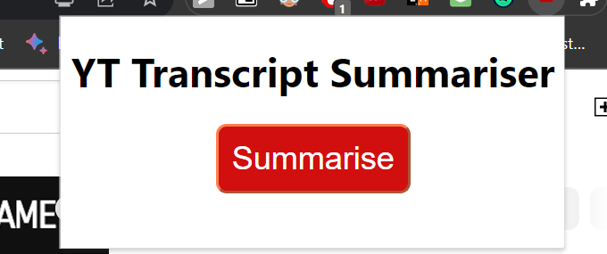
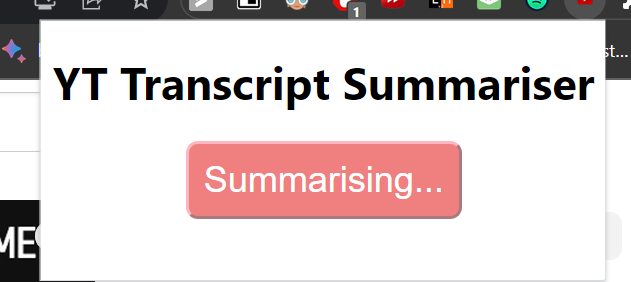
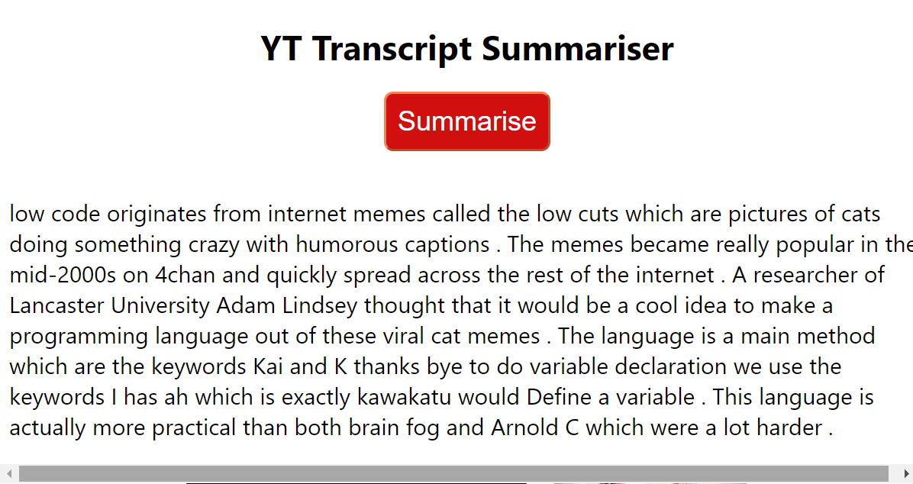

# YouTube-Video-Summariser

A chrome extension to summarise long YouTube videos by utilising YouTube's transcript feature.

## Requirements

- The following python modules must be installed to run the API
  - `flask`
  - `youtube-transcript-api`
  - `transformers`

## Instructions

- Run `app.py` to start the summarizer API.
- Load the custom extension into any Chromium browser.
- Go to any YouTube video and click on the extension logo to start summarizing.

## Some Snapshots

<table style="width:100%;">
  <tr>
    <td></td>
    <td></td>
  </tr>
  <tr>
    <td colspan="2"></td>
  </tr>
</table>
